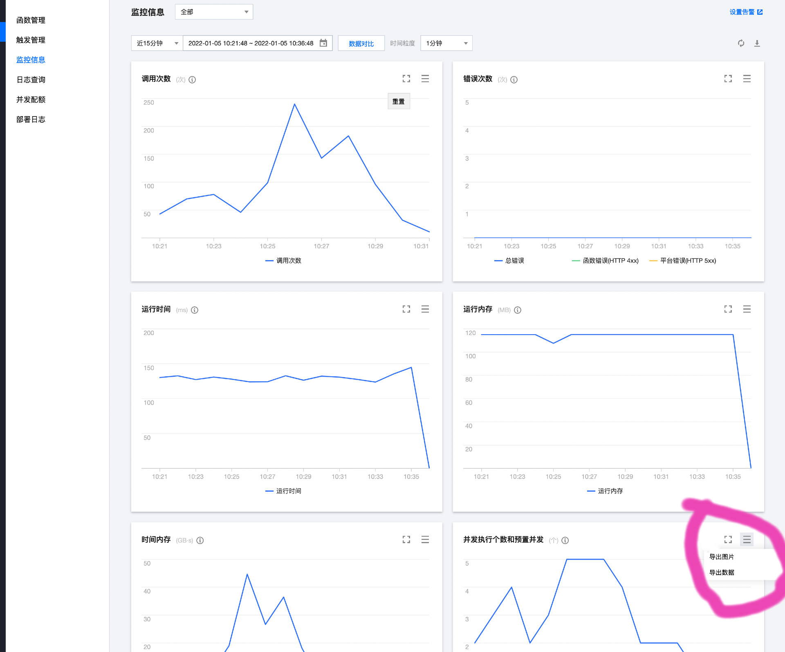

## Analytics concurrency

此 repo 包含了两个计算脚本 `parseCSV.js` 和 `timer.js`, 可以根据云函数的请求量来计算合适的预置并发配置

### 使用步骤

1. `git clone git@github.com:serverless-components/Analytics-concurrency.git`
2. 安装依赖: `npm install`
3. 在腾讯云控制台找到想要统计的云函数，通过 **监控信息**可以获取云函数的**并发执行个数和预置并发**此项数据, ，将 csv 数据下载到此脚本仓库的`resources`(如没有此文件夹，自行创建即可), 注意事项:
   1. 下载的每一天的数据，**必须保证选取的粒度相同**
   2. 下载的 csv 文件建议使用*日期+函数名*命名
